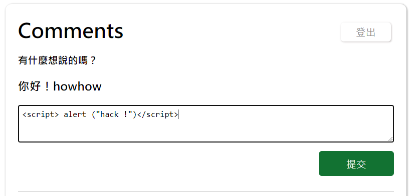

## 請說明雜湊跟加密的差別在哪裡，為什麼密碼要雜湊過後才存入資料庫
---
- 第一種方式：加密（Encryption）
1. 加密解密都須透過金鑰（key）才能進行
2. 因為是一對一之對應關係，因此當 key 被他人知道就會被還原密碼，有風險。

- 第二種方式：雜湊（Hash function）
1. 將明文密碼**透過 hash 演算法**變成一段固定長度的密文
2. 當不同的內容卻輸出一樣的值時，這個情況稱為「碰撞」，所謂的鴿籠原理，但好的雜湊演算法，產生碰撞的機率是很低的。
3. 多對一的對應關係，因此當密文被知道時他人也無法反推明文密碼，安全性相較加密來的高
4. 常見演算法：md5、SHA 系列

將使用者的密碼做雜湊後將其儲存在資料庫，這麼做是為了防範某一天資料庫不小心被破解，最重要的密碼也不會被拿走去做其他用途，保護使用者。


## `include`、`require`、`include_once`、`require_once` 的差別
---
這幾個 statement 的功能都是在 php 檔裡引入外部 php 檔案的程式碼，但他們的差別可以先從字面來看，require_once 以及 include_once 的 php 檔基本上都只能被引入一次，require 產生的錯誤會強制停止程式，但 include 產生的錯誤只會生成警告，程式會繼續執行。

論使用時機：<br>
require()：如果想在遇到丟失檔案或遇到錯誤時停止處理頁面就用，或是引入的檔案極為重要，例如要引入登入檢查時若發生錯誤，就不會產生後續非登入者可看到的東西。<br>
include()：如果想在遇到錯誤時繼續處理頁面，或是匯入的模板或是檔案是非必須的。

## 請說明 SQL Injection 的攻擊原理以及防範方法
---
攻擊：利用輸入不正當的文字去攻擊 SQL query 的指令，讓 query 去執行其他事情，可稱為駭客填字遊戲
1. 可以在登入的時候不用輸入密碼就可以登入
2. 在留言的時候去模仿任何人發文
3. 甚至去拿到資料庫的資料，甚至修改資料，如改購物網站的售價

例如：原來正常傳入的指令如下
```
$sql = insert into comments(nickname, content) values('howhow', 'handsome')
```
攻擊時去留言一串不正常的指令，如傳入 `am hacker'),('froggy','gogogo`，造成 sql 傳入兩筆資料
```
$sql = insert into comments(nickname, content) values('howhow', 'am hacker'),('froggy','gogogo')
```
如何解決：利用 prepared statement 
中文為「參數化查詢」，將 sql 語法做改寫，主要是先將輸入的東西把它當作字串或數字等，再去執行 sql 去做規避，以下為範例。

```
<?php
		$sql = "insert into comments(nickname, content) values(?, ?)"; // 準備好 SQL 語法，用問號（稱為佔位符或參數 placeholder）替換所有變量
    $stmt = $conn->prepare($sql); // 準備結果查詢
    $stmt->bind_param('ss', $nickname, $content); //將所有變量綁定到先前準備的語句，s 代表 string，i 代表 integer， ss 代表兩個變量
    $result = $stmt->execute(); // 執行語句
    $result = $stmt->get_result(); //拿到結果
?>
```

##  請說明 XSS 的攻擊原理以及防範方法
---
攻擊：在網站內別人可以透過輸入某些指令或是用 javaScript 等等語法去做其他事，也泛指利用網頁開發時留下的漏洞做攻擊，像是偷到其他使用者的密碼、Session ID 等等，或是將使用者導入釣魚網站。此稱為 XSS ，全名是 Cross-site scripting ，中文為跨網站指令碼攻擊。

例如：本應在留言區輸入一般留言的，卻刻意用 html 標籤帶入指令，提交後瀏覽器就會跳出指令，非正常行為。



防範：利用 htmlspecialchars() 來將呈現的內容做規避
1. 若常使用的話可將其函式化
2. 不推薦將資料先做規避後存入資料庫，而是呈現時再做，主要原因為手機 android 或 ios 也會抓取資料庫的內容做顯示，但他們看不懂被轉換後的資料
3. 將所有使用者可調控的地方做規避
## 請說明 CSRF 的攻擊原理以及防範方法
---
CSRF ，跨站請求偽造， 是一種 Web 上的攻擊手法，駭客利用使用者「不知情」的情況帶登入的狀態（如 session id）去操作一些隱私的敏感的功能，如轉帳，修改資料等，也為作俗稱為連結攻擊（One Click Attack）。

攻擊方式：
1. 用 `<a href='...'>請點擊</a>` 做一個超連結讓使用者去點擊發送 request 做其他操作
2. 開啟網頁後用 `` 自動發送 request 做其他操作
3. 用 iframe 標籤去帶 form ，自動 submit 發送 POST 出去

**使用者端的解決方式：**

登錄網站後不要去瀏覽其它不明的網站，使用完網站後就登出，但對使用者亦即每次都需做登入的動作

**Server 端的解決方式：**

1. 用戶輸入簡訊驗證碼、圖形驗證：
    - 如網路銀行轉帳，需輸入簡訊驗證，但實際操作上會讓使用者體驗不好，因為每一次操作就要驗證一次太花時間。
2. 驗證 referer：
    - 打開 devtool 可以看見 request 的 header 裡面會帶一個欄位叫做 referer，紀錄當前傳過來的來源 domain，server 會去檢查是否為合法的 domain。
3. CSRF token (最常使用)
    - server 隨機產生一組 CSRF token ，把其塞在使用者的隱藏的 form 裡面，存在 client 端，也存在 server 的 session 中，在使用者 submit 發送 request 時去檢查這串 CSRF token  是否和 server 存放的是否相同，另外 CSRF token 每一段不同的 session 就應該要更換一次。
4. Double Submit Cookie
    - 相較於 CSRF token 這個解法不需要 server 儲存東西。
    - server 隨機產生一組 token，把其塞在使用者的隱藏的 form 裡面，然後在 client 端設定名叫 CSRF token 的 cookie，值也是同一組 token，利用「cookie 只會從相同 domain 帶上來」機制，使攻擊者無法從不同 domain 戴上此 cookie。
5. client side 的 Double Submit Cookie
    - 由 client side 來生 csrf token ，流程都跟之前一樣，生成之後放到 form 裡面以及寫到 cookie。或者說如果你是 SPA 的話，也可以把這資訊直接放到 request header，你就不用在每一個表單都做這件事情，只要統一加一個地方就好。
    - 某些 library（如：axios），只要設定好 cookie 的值，會幫你自動在 request 的 header 填上 cookie 值，就不用每個表單都要手動加。

**瀏覽器端的解決方式：**

Google 在 Chrome 51 版時加入此功能「SameSite cookie」。只要將妳原本設置的 Cookie 的 header 改幾行代碼即完成。

原來設定 Cookie 的 header 是：

`Set-Cookie: session_id=ewfewjf23o1;`

只要在後面多加一個 SameSite

`Set-Cookie: session_id=ewfewjf23o1; SameSite`

預設值是 strict，但還有 Lax 模式，則可以放寬一些限制保有彈性

代表說「我這個 cookie 只允許 same site 使用，不應該在任何的 cross site request 被加上去」，所以無論是 `<a href="">`、 `<form>` 、 `new XMLHttpRequest`，只要是瀏覽器驗證不是在同一個 site 底下發出的 request，全部都不會帶上這個 cookie。
