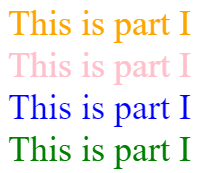

## Webpack 是做什麼用的？可以不用它嗎？
Webpack 是一個「模組化的打包工具」。<br>
**模組化**：在剛學習開發時會把所有的功能和邏輯都寫在同一個檔案，對於小型的 project 來說不會有太大的問題，但在大型的 project 下後續的維護則會非常痛苦，因此將各個功能和邏輯拆分成一個個不同的檔案（模組），再做引入的這種方式會較為方便管理。<br>
**打包**：將不同的檔案（模組）和資源透過 webpack 做編譯並且整合成幾隻瀏覽器看得懂的檔案，尤其現今前端的工具日新月異，瀏覽器的支援跟不上新語法和新的框架，因此透過打包自動化去做編譯和整合檔案，讓瀏覽器能順利執行。例如將圖片做壓縮、程式碼做壓縮、做 SASS 預處理工具的工作或是轉換 ES6 語法。

可以不用它嗎？若是在較小的專案下可以不用，但若是在大型的專案下會較方便做管理，後續的維護也會比較清楚各個模組的功能。

## gulp 跟 webpack 有什麼不一樣？
gulp 只是一個 task manager，前端自動化構建的工具<br>
目的：開發者可使用它來建構自動化工作流程，藉由簡化工作量，可讓開發者將重點放在功能的開發上。例如做 babel、scss、 rename、壓縮等。

webpack 是 module bundler，是打包的工具<br>
目的：利用模組化的概念，將各種資源打包成能在瀏覽器上執行的程式碼。

gulp 像是寫好一個腳本，只要下一個指令，就可以自動根據設定去完成各項任務，比較像是一個規劃暨觸發執行任務的工具，然而 webpack 則會像是實際的去執行整合這個任務的工具。

## CSS Selector 權重的計算方式為何？

- 問題：初學 css 時，有時候會遇到一個問題是為什麼我明明有設定某個元素的 css style，但是前端頁面卻沒有根據設定去做渲染，原因可能是 css 權重在作祟，也就是某個選擇器的權重蓋過你想設定的選擇權重，概念有點像是 z-index ， z-index 設定較大的元素會覆蓋較小的元素而顯示在其上層。

- 了解的目的：在多個選擇器都對同一個元素做出樣式的聲明時，到底是哪個 CSS 的設定會生效

- 說明：可以先說明基本的 css 權重，後面則會有範例 。<br>
    基本的 css 選擇器的權重如下由高至低排列，若權重相等時，後寫的樣式宣告會蓋過先前的樣式宣告。

    ```
    !important > 
    inline style > 
    ID > 
    Class/psuedo-class(偽類)/attribute（屬性選擇器） > 
    Element > 
    *
    ```

    1. `*` ：為全站預設值，權重值為 0-0-0-0-0
    2. Element ：為常見的 html tag 標籤，如 `div, p, ul, ol, li, em, header, footer, article...` ，權重值為 0-0-0-0-1
    3. class ：就是一般 html 的設定，如 `class="box"` ，css 用 `.box` 來選擇元素，權重值為 0-0-0-1-0
    4. psuedo-class(偽類)：如： `:nth-child()、:link、:hover、:focus` 等，權重值為 0-0-0-1-0
    5. attribute（屬性選擇器），如： `[type:checkbox]、[attr]`     
    6. ID 也是選擇器的設定，如 `id="home"` ，css 用 `#home` 來選擇元素，權重值為 0-0-1-0-0
    7. inline style attribute：如在 html tag 內設定 style，權重值為 0-1-0-0-0

        ```html
        <div style="color:red">
            CSS Specificity
        </div>
        ```
    8.  !important：設定這個可以蓋過所有的權重，但是盡量不要用，因為也只有後續設定其他的 !important 可以蓋過它，會讓 css 很雜亂

        ```css
        .product{
            width: 200px;!important
        }
        ```
    範例：
    HTML
    ```html
    <div>This is part I</div>
    <div class="pink">This is part I</div>
    <div id="blue" class="pink">This is part I</div>
    <!-- 0, 1, 0, 0, 0 -->
    <div id="blue" class="pink" style="color: green;">This is part I</div> 
    ```
    CSS：
    ```css
    /* 0, 0, 0, 0, 1 */
    div {
    color:orange;
    font-size:1.5rem;
    }
    /* 0, 0, 0, 1, 0 */
    .pink {
    color:pink;
    }
    /* 0, 0, 1, 0, 0 */
    #blue {
    color:blue;
    }
    ```
    結果：<br>
    

    參考資料：

    1.  [Day20：小事之 CSS 權重 (css specificity)](https://ithelp.ithome.com.tw/articles/10196454) 
    2.  [CSS Specificity Devopedia](https://devopedia.org/css-specificity) 
    3. [[基礎CSS教學] CSS Specificity | CSS 權重 教學 | !important](https://www.youtube.com/watch?v=MjjdAVtDRls&ab_channel=BigBoyCanCode)