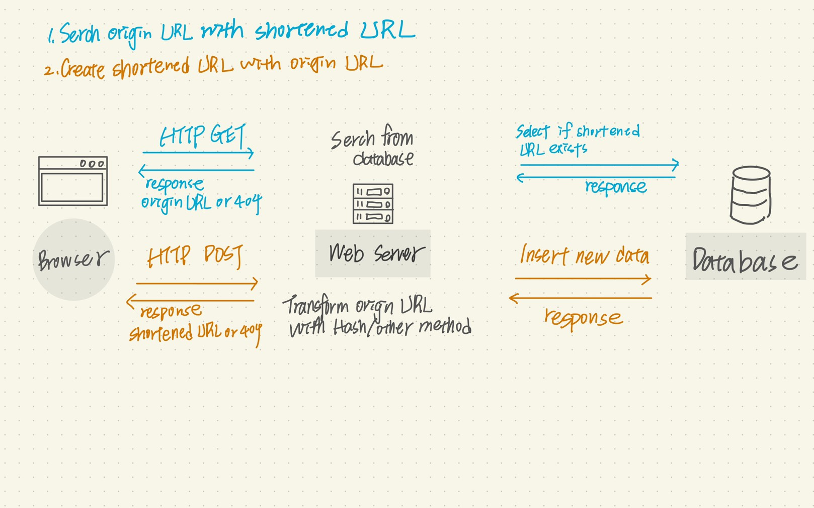
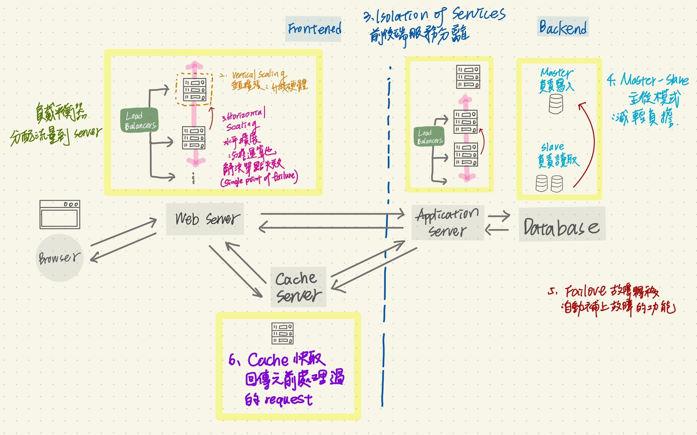

## 為什麼需要短網址？
**目的：**
1. 好記的短網址相較於沒有意義的字母加符號要來的美觀、好記以及便於分享，甚至是避免網址因過長而被截斷傳送的問題。
2. 短網址服務本身內建統計功能。以目前數據時代來說可蒐集到造訪的來源，所以一個長的網址可以對應多個短網址。

**如何產生短網址：**

有兩種演算法能將長網址轉換成短網址，一個是自增序列算法、 另一個是摘要算法
1. 自增序列算法：初次申請短網址時會在資料庫設置三個欄位，第一個為 id ，為上一組資料 id + 1，第二個為長網址，第三個為短網址，短網址產生則由此十進位制的 id+1 轉換成六十二進位制的字串符號，再將其接到網域後面回傳。此方法優點是不會發生衝突，每個短網址都是獨一無二，缺點是短網址是有序的，會有安全問題，可結合其他演算法來解決。
3. 摘要算法：又稱非加密型哈希算法，將輸入的長網址透過此算法轉變成短網址，再將其接回網域後回傳。優點產生的短網址是無序的，不可逆轉破解，但存在著碰撞的可能性。

**輸入短網址後會發生什麼事：**

假設我們再瀏覽器輸入了 http://goo.gl/test 這一串短網址，它被先被發送給 DNS 做解析，會先解析 http://goo.gl 的 IP 地址，再向此 IP 發送 HTTP GET 的需求並帶上 test 給短網址的 server，這時候 server 若查詢到有此對應的長網址時，會透過 HTTP 301/302 將使用者轉到對應到真的想造訪的網站，若沒查詢到則回傳 404 。

備註： 301轉址是永久性轉址，一旦瀏覽器接受到 301 的轉址會將其新網址做暫存，下次造訪時則不會造訪短網址伺服器，意味著我們無法知道這個短網址被點擊的次數，因此設定 302 做暫時性轉址。

整個流程分為 1. 用短網址來搜尋原來的網址 2. 用原來的網址才產生短網址

以下為有關系統設計和各優化的項目：

其它：
- Google 基於安全考量，在2019年正式終止這項服務。所以，當短網址服務釋出一塊大餅後，其他廠商如雨後春筍般的湧出

參考資料：

[【林克威專欄】電商行銷者為什麼會使用短網址？](https://tomorrowsci.com/master/%E3%80%90%E6%9E%97%E5%85%8B%E5%A8%81%E5%B0%88%E6%AC%84%E3%80%91%E9%9B%BB%E5%95%86%E8%A1%8C%E9%8A%B7%E8%80%85%E7%82%BA%E4%BB%80%E9%BA%BC%E6%9C%83%E4%BD%BF%E7%94%A8%E7%9F%AD%E7%B6%B2%E5%9D%80%EF%BC%9F/)

[短址(short URL)原理及其實現](https://www.itread01.com/content/1541559622.html)

[瀏覽器 HTTP 301 導向記錄清除](https://blog.darkthread.net/blog/clear-browser-301-record/)