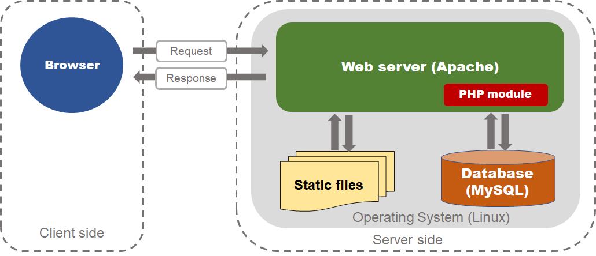

# 部署的心得
一開始不太曉得部署是什麼意思，在想是不是像幾周前的作業一樣把動態網站透過 FileZilla 上傳，然後輸入網址看到網頁這整個動作就叫部署，再來是看課綱寫租主機然後連結網域，把 PHP 網站放到自己的主機上，並且連 MySQL，算是有一個大概的做法，但心中還是有個疑問到底怎樣才叫做部署，或是 apache/ MySQL/ FileZilla 在一個 request/ response 的事件扮演的角色以及位置在哪。

不過這周滿奇妙的是 Huli 希望大家自己先查資料自己嘗試部署看看，不過在 google 的時候還是會看到學長姐的文章手把手的教學，我了解那就是作業二的正解，所以這時候陷入兩難，一是直接看那個教學，可以最快弄好部署，最符合效率的做法，但成就感會最低，二是我就是繞過那些文章不看，用其他的方式來弄，預期花費的時間會最多，但可以學到更多東西，所以方法二就有點像是今天要爬百岳，你不爬文看要怎麼爬，就直接在 google map 搜尋並驅車前往，一到就開始往山頭攻，雖然過程可能會迷路或繞路，不過相較於方法一來說最後一樣是抵達相同的目的地，但感動度會是最多，印象也會是最深刻，所以哪個方式好自己覺得並沒有一定，自己考量進度目前是落後的，所以就直接看文章一步步先把網站架起來，看是否會花太多的時間，有時間再回頭看這些步驟的原因為何，最後結果是花兩三天照步驟做，其他時間就研究課綱自我檢測的項目或是其他部署觀念。

正文開始，我認為的網頁部署大致有幾個步驟：
1. 選擇一種主機（hosting）：區分幾種類型，虛擬主機、VPS、實體主機，雲主機，各有其優缺點，端看需求去選擇。
2. 取得網域名稱（domain name）：因為 IP 不容易被使用者記住以及考量到資安問題，需要申請一個網域做替代，並將 IP 連結網域名稱，網域可延伸出 subdomain (子網域,子網址) 做使用，簡單來說就是花錢買一個有意義的網址。
3. 在主機上選擇作業系統，但若是選擇虛擬主機，則有可能作業系統已經設定好，常見的作業系統有：Unix、Linux、OS2、Windows 等
4. 選擇網頁伺服器 (web server) 並安裝：這裡指的是架設在作業系統上的軟體，放至網站相關檔案(HTML、CSS、JS...) 的地方，通常會有指定的根目錄做存放，此伺服器也是第一線接受 request 的地方，由它決定要怎麼回應客戶端的需求，像是「Apache」基於 Unix 與 Linux 開發出來的軟體，是公開原始程式碼，是目前世界上用來架設網站使用最多的伺服器軟體，其他像是「Windows Server IIS」，但其並不公開原始程式碼。
5. 若網頁是動態網頁，需要架設資料庫，而網頁伺服器和資料庫的溝通會有其特定的程式語言，如 php、perl、python

- LAMP（Linux-Apache-MySQL-PHP）是一個網頁應用的技術棧 (Web application stacks)，也是目前國際流行的 Web 框架，但 LAMP 這些技術、軟體並非一開始就被設計綁在一起使用，而是他們開源、成本低、可靠性高，並且相容性不斷提升，所以被一起使用的情況越來越普遍。

- 從 LAMP 的關係圖來看：

1. 在靜態請求下，Apache 會去找尋存在 Linux 某個目錄下的檔案，先回傳給 Apache 再回傳給使用者。
2. 在動態請求下，Apache 會透過 php module 去和 MySQL 撈取相對應的資料，透過設定的邏輯去決定如何回傳的使用者。

其他：

1. Ubuntu 是屬於 Linux 的一個發行版本，因為它有漂亮的使用者介面，相對於其他版本會更好上手，完善的管理系統，支援度強，豐富的技術社群，對大多數硬體有著良好的相容性。
2. 什麼是 SSH 遠端連線？全名是 Secure Shell，是一個連線加密的機制，透過此機制能用來從本地端帶連線到遠端的主機，相對於早期 FTP, Telnet 是用明文傳遞資料， SSH 則是以加密技術進行封包加密來傳送資料，只有被認可的人可以解密，確保在過程中不會被竊取資料，所以 FileZilla 是透過此方式並帶上金鑰來和遠端的 server 連線並傳輸資料。
3. LAMP 和 XAMPP 的不同？  XAMPP 的 X 基本上就代表跨平台的意思，它支援 Linux、Windows、 MacOS、Solaris，所以 LAMP 也只是代表某一種 Web 技術棧的架構，若作業系統選擇 windows，則可簡稱做 WAMP。
4. 網域設定 A 和 CNAME 的不同？設定 A 代表我要將某個網域綁定指定的 IP 位置，設定 CNAME 則是代表某個 A 網域的子網域，所以是綁定 A 的。