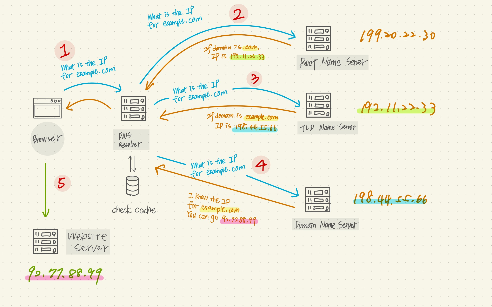

## 什麼是 DNS？Google 有提供的公開的 DNS，對 Google 的好處以及對一般大眾的好處是什麼？
DNS 中文是網域名稱系統，由不同層級的名稱伺服器所組成。在網際網路的世界每台伺服器的實際地址都是用 IP 來表示，當我們在電腦或是手機搜尋某個未造訪過的網址時，第一站會到 DNS 查詢 IP 並帶回給使用者瀏覽器並前往，DNS 它就像計程車司機，例如我告訴司機說要去「台北 101」，司機就會知道那是在「台北市信義區信義路五段7號」，你不需要知道這個地址，但它就是可以帶你到你想到的地方，這就是 DNS 主要的工作。

但全世界的網址這麼多，若是一台 DNS 伺服器是要怎麼應對這麼多的查詢需求，這個問題利用了「階層式（hierarchy）」的架構來管理，透過「授權（delegation）」讓各層、各個網域名稱持有者自行安排「權威主機（authoritative name server）」管理，所以是由遍佈全球的名稱伺服器（Name Server）來處理各種查詢的需求。

若從網域階層來看：<br>
1. 根網域（Root domain）：是 DNS 架構最上層的伺服器，全球共約 16 台，主要負責提供 .tw、.gov、.com 等各種「頂級網域（Top-Level Domain，簡稱TLD）」權威主機的 IP 資訊，所以此伺服器一旦被駭客攻擊，影響範圍可能會以「國家」為單位來算。
2. 頂層網域（Top-Level Domain）：它和根網域一樣不會知道最終要查詢的 IP 為何，但它會知道要去哪裡找負責該網域的名稱伺服器，也就是提供找到 Second-level domain 伺服器的 IP。
3. 第二層網域（Second-level domain）：通常為向各國的網址註冊單位申請的網域。
4. 再往下延伸的其他網域...

以下方的範例和步驟可以得知其相關的互動：
第一站會到遞迴解析程式（Recursive Resolves）又稱 DNS Resolver 伺服器，會記錄根網域的IP地址，並幫我們發給相對應的根網域做詢問，通常為我們的網際網路服務供應商（Internet Service Provider，ISP），例如中華電信。



以上為了加速查詢的效率，各個名稱伺服器，甚至我們的瀏覽器，都有實作快取（cache）機制，來保存先前查詢過的域名及IP地址。


## 什麼是資料庫的 lock？為什麼我們需要 lock？
---
**Transaction** <br>
是資料庫裡面有個很重要的概念，例如說轉帳，A 轉帳 100 塊給 B，這時候會產生兩個 sql query，A 的帳戶要少 100 塊和 B 的帳戶要多 100 塊，但今天某一個 sql query 出錯了怎麼辦？因為只有一個 sql query 成功會很奇怪，所以 Transaction 下必須確保這些不可分割的 query 集合都要成功。

其他應用：購物（一次買多個品項，確保每個下單都有庫存）、其他一次牽扯到多個 query 的操作

**如何執行 Transaction** <br>
以下同時執行多個 SQL
```
$conn->autocommit(FALSE); // 整個連線執行的 SQL 指令，都會等到下達 commit 提交後，才會真正儲存變更
$conn->begin_transaction();  // 開始 transaction
$conn->query("update from money set amount = 20");
$conn->query("update from money set sum = 10");
$conn->commit();        // 當發出 commit 後才會執行
```
**Lock 資料鎖定** <br>

為了避免多個 request 同時抵達 server 去執行相同的 query 而去修改了同筆資料造成錯誤的事件發生，我們需要在 sql query 加上 Lock 來將資料鎖定，也就是確保 sql query 要有先後順序。

將想要 lock 住的條件加上 for update，所以當有 request 執行到此條件就可以先往下跑，其他 request 就必須等待上個 request 執行完才可執行，但缺點是會有效能上的損耗，若沒有指定欄位的話會鎖住 Schema 欄位，會有更大的效能上的損耗

範例如下：
```
$conn->autocommit(FALSE);
$conn->begin_transaction();
$conn->query("SELECT amount from products where id = 1 for update");
$conn->commit();
```

**什麼情況需要 Lock 鎖** <br>
例如限量商品或搶購演唱會門票會發生「超賣」的情形，在電腦科學上被稱作 race condition（競爭危害），因此我們需要用此 Lock 鎖來避免系統和資料庫發生錯誤。

## NoSQL 跟 SQL 的差別在哪裡？
---
- SQL 是結構化查詢語言，常被拿來用在和關聯式資料庫相關的 CRUD，因此你不會說我的資料庫叫做 SQL
- NoSQL 是非關聯式資料庫，以下有幾個特點：
1. 沒有 Schema 的概念，因此不能像關聯式資料庫，利用 JOIN 把很多資料串連
2. 以 key-value 的方式儲存
3. 通常儲存資料的格式是 JSON
4. 可以用來存結構不固定的資料
5. 彌補了關聯式資料庫某些方面的不足，例如節省開發成本和維護成本
- NoSQL 應用場景：社交軟體蒐集使用者的互動資料或是手機 app 想蒐集用戶相關的資料，如取得手機的任何狀態以進行後續的資料分析。

- 個人的心得：使用 NoSQL 時代表重量不重質，大量撈資料來做分析，使用 MySQL 會是重質不重量，會要嚴謹的處理資料來做回應

## 資料庫的 ACID 是什麼？

**原子性（Atomicity）**<br>
確保這些 query 的集合每筆都要執行成功，若有一個失敗，則宣告整個事件失敗，其他成功的也必須撤回，恢復原本的狀態

**一致性（Consistency）**<br>
在 Transaction 完成前後去檢查是否符合設定的規則，例如轉帳前後雙方錢的總和不能改變

**隔離性（Isolation）**<br>
多個 transaction 之間不會互相干擾，假設在同個時間有多個 transaction 對某筆資料進行處理，若某些 transaction 發生錯誤恢復原本狀態，又另外某些 transaction 成功修改，此時會造成此資料是不正確的數值，因此需要把欄位鎖起來（不給操作），防止其他的操作也修改到同一個值

**持續性（Durability）**<br>
一旦 transaction 成功後就算系統掛了，伺服器當機、斷電等等，這些已經修改的數據也不會不見，應該要被寫入能夠永久儲存的裝置中，而不是暫存

參考資料：<br>
[DNS 伺服器是什麼？如何運用？](https://www.stockfeel.com.tw/dns-%E4%BC%BA%E6%9C%8D%E5%99%A8%E6%98%AF%E4%BB%80%E9%BA%BC%EF%BC%9F%E5%A6%82%E4%BD%95%E9%81%8B%E7%94%A8%EF%BC%9F/)
[域名系統（DNS）101—網址的小旅行](https://medium.com/%E5%BE%8C%E7%AB%AF%E6%96%B0%E6%89%8B%E6%9D%91/%E5%9F%9F%E5%90%8D%E7%B3%BB%E7%B5%B1-dns-101-7c9fc6a1b8e6)

[根域名伺服器的重要性、現況與爭議](https://blog.twnic.tw/2019/02/22/2673/)

[閃開！讓專業的來：SQL 與 NoSQL](https://ithelp.ithome.com.tw/articles/10187443)

[關於NoSQL與SQL的區別](https://read01.com/GPnEx.html#.YS5KMY4zaUk)

[MySQL 交易功能 Transaction 整理](https://xyz.cinc.biz/2013/05/mysql-transaction.html)

[後端基礎：資料庫 & 系統設計](https://heidiliu2020.github.io/backend-system-design/)