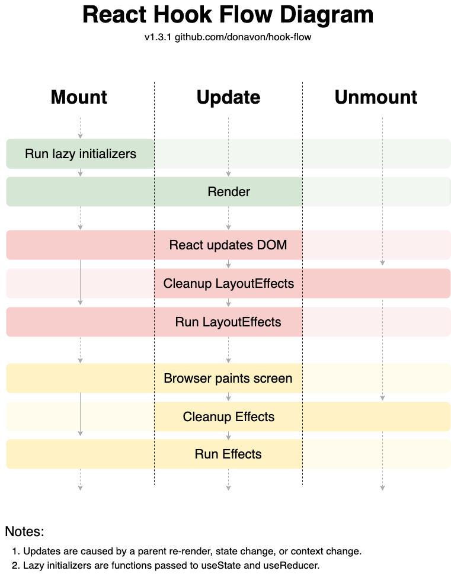
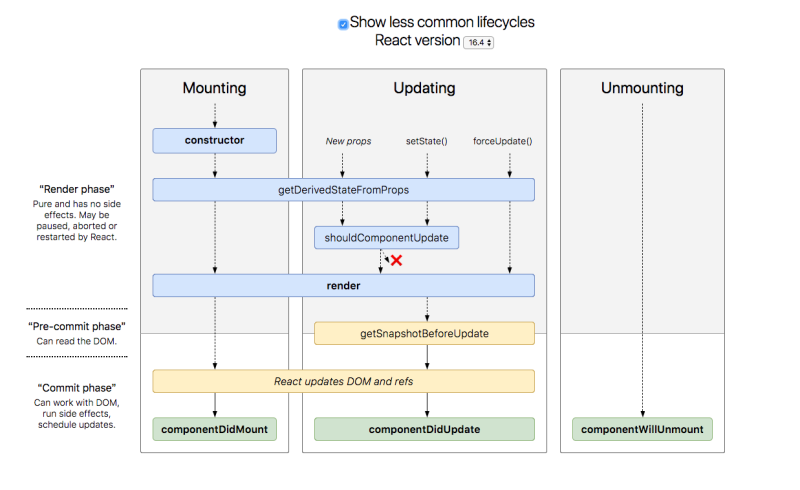

## 請列出 React 內建的所有 hook，並大概講解功能是什麼
---
### React Hook 的規則
可以先從這些 hook 在使用時有什麼樣的規則開始講起： <br>
1. 只能搭配 function component 使用，搭配 class component 是不行的。
2. 在 function component 使用時需要在**最上層**做呼叫，也就是不要在迴圈、條件式或是巢狀的 function 內呼叫，這樣的方式是為了確保每一次 render component 時執行 hook 的順序是一樣的。
3. 以下各個 hook 都能搭配下圖 function component lifecycle 來看他們會在哪時候執行，這個釐清非常重要，因為往往結果不是如想像的那樣時就是有可能搞錯 hook 的執行順序以及各 hook 的使用方式。


### useState （lifecycle ： render 階段，mount 和 update 時都會執行）
```
const [value, setValue] = useState(initialValue)
```
- value 為自訂義的 state
- setValue 為更新這個 value 的 function，每當 state 被更新，就會觸發 re-render component 
- initialValue 為第一次 render 時 state 的初始值，可以傳入 string、number、object 各種型態

使用注意事項：
1. setValue 的使用是非同步的，因此在短時間內連續按下按鈕會發生不是預期的結果，例如以下連續按按鈕 re-render 時 `setValue(value + 1)` 並不會依照我們預期印出 2、3、4...。

```JavaScript
export default function App() {
  const [ value, setValue] = useState(1)
  
  function handleClick() {
    setTimeout(()=>{setValue(value + 1)},3000)
  }
  console.log(value)

  return (
    <div className="App">
      <button onClick={handleClick}>按鈕</button>
    </div>
  );
}
```


若 func 部分改寫成以下就能改善
```JavaScript
function handleClick() {
    setTimeout(()=>{setValue(value => value + 1)},3000)
  }
```


2. 上一個例子說到 setValue 是非同步的，因此在使用 setValue 更新 value 後若直接 `console.log(value)` 印出時也不會是你預期的結果。如以下例子，value 的初始值是 1，當你按下三次按鈕時你預期在 setValue(value + 1) 完會印出 2、3、4，但結果是 1、2、3，這個解決方式可以用待會會介紹到的 useEffect。

```JavaScript
export default function App() {
  const [ value, setValue] = useState(1)
  
  function handleClick() {
    setValue(value + 1)
    console.log(value)
  }

  return (
    <div className="App">
      <button onClick={handleClick}>按鈕</button>
    </div>
  );
}
```


3. initialState 參數只會在初始 render 時使用，但在後續 component re-render 時還是會執行到 initialState 的設定，但是今天若這個初始設定是一個很複雜的過程就會很吃效能，因此我們可以用 Lazy initial state 來改善，可以傳入一個 function，回傳的東西就是初始值，只會在初始 render 時被執行，re-render 並不會被執行。<br>
將上面的程式碼改寫以下的部分，原本的情況是 "複雜的運算" 在按下按鈕 re-render 時都會被印出，但 initialState 改寫成 function 時在 re-render 時就不會再被印出

```JavaScript
const [ value, setValue] = useState(complicatedfunc())
  console.log(value)
  function complicatedfunc() {
    console.log('複雜的運算')
    return 1
  }
```


```JavaScript
const [ value, setValue] = useState(() => {
    console.log('複雜的運算')
    return 1
  })
  
  console.log(value)
```


### useEffect （lifecycle ： run effects 階段，mount 和 update 時都會執行）

```JavaScript
useEffect(() => {
    //do Something
   return () => {
       // Cleanup whatever we did last time
   }
}, [dependencies array])

```
- 第一個參數為 Effect function，會是瀏覽器畫完畫面後執行某件事情
- 可以傳入第二個參數 dependencies array，為 optional，根據陣列的設定來決定何時執行 Effect function，代表當傳入的參數有變動才會執行。
- cleanup effect：若有執行過 useEffect 則會先執行上一次 return 的函式，再執行新的 useEffect，使用時機大部分是 unsubscribe、取消監聽器或是取消 API，此功能也是為 optional。


useEffect 有幾種使用情況：
1. after every render： 每次 render 後都執行
```JavaScript
useEffect(() => {
  //do Something
})

```
2. Once：dependencies array 傳入 (`[]`) 代表只會在初始 render 完後執行一次，後續 re-render 不會再執行，可以用來執行非同步的事情，如網路請求、監聽事件、訂閱、或手動改變 DOM
```JavaScript
useEffect(() => {
  //do Something
}, [])
```
3. state/props change：當 state, props 有變動時才執行
```JavaScript
useEffect(() => {
  //do Something
}, [state, props])
```
4. cleanup：先執行上一次 return 的函式，再執行新的 useEffect
```JavaScript
useEffect(() => {
  //do Something
  return () => {
    // Cleanup whatever we did last time
  }
}, [])
```

### useContext

- 為了避免 Props drilling 可以使用，父層 Component 不需要透過 render props 來傳遞 value 給下層、甚至是好幾層下的子元素，讓中間沒有用到此 value 的子元素不用經手此傳遞的行為

作法：
1. 父層 Component 以 createContext 建立一個 Context Component ，並將要傳遞的資料放到它的 value 中
```Javascript
const AuthContext = createContext(null);
function App() {
  const [user, setUser] = useState(null)
  return (
    <AuthContext.Provider value={{user, setUser}}>
      <Header>
      {/*其他元素*/}
    </AuthContext.Provider>
  );
}
```
2. 子層 component 用 useContext 承接參數並使用，另外一點是 Context 的值匯市取決於由上層 component 距離最近的 <Context.Provider> 所傳的 value prop。
```Javascript
function Header() {
  const { user, setUser } = useContext(AuthContext)
  //以下使用此傳進來的參數
}
```

### useRef
主要有兩個功能：1. 可存放 mutable 的值 2. 可用來抓取 DOM 節點
1. 存放 mutable 的值
在 refContainer 設定初始值 initialValue，可以用其屬性 `.current` 來存取，和 useState 差別在於它更新值時不會觸發 re-render。

```Javascript
const refContainer = useRef(initialValue);
```

2. 抓取 DOM 節點：以官網的範例來看，以下點選 button 後觸發 onButtonClick ，執行 inputEl.current 會去抓取 input 的 DOM

```Javascript
function TextInputWithFocusButton() {
  const inputEl = useRef(null);
  const onButtonClick = () => {
    // `current` points to the mounted text input element
    inputEl.current.focus();
  };
  return (
    <>
      <input ref={inputEl} type="text" />
      <button onClick={onButtonClick}>Focus the input</button>
    </>
  );
}
```

### memo 、 useMemo、 useCallback
當使用 function component 時常常因為 state 的改變造成元素重新渲染，但是今天有些子元素因為沒有改變，其實並不需要重新渲染，因此 memo 、 useMemo、 useCallback 這三種方法就是來避免這樣的情況發生，進而可以減輕瀏覽器的負擔、優化網站效能。
1. memo：
當父層狀態改變，子元素也會重新渲染，但若子元素沒變你不想再渲染一次子元素時就可以用 React memo ，主要是存一個 pure function component，傳進來的 props 有動才會再執行這個元素，不過它是 shallowly 的比較，也就是若傳 object 在比較上會被認為是不一樣（記憶體位置的關係），所以如果傳進來的 props 有用如 callback func 就會額外設定 memo 的第二個參數 reEqual，並設定 reEqual。
```Javascript
cosnt MemoButton = memo(Button)
```

2. useCallback：剛提到可以用 reEqual 解決問題，我們也可以用 useCallback 來解決。第二個參數是 dependencies array，代表這個 callback func 會使用到的參數，當參數有變動時才會去執行。
```Javascript
const memoizedCallback = useCallback(
  () => {
    doSomething(a, b);
  },
  [a, b],
);
```

3. useMemo：與 useCallback 不同的是它是緩存一個 value，當今天有一個複雜的計算在每次 re-render 時若都要重新計算會造成效能浪費，因此可以使用 useMemo 將 value 記憶起來，一樣需傳入參數至 dependencies，參數沒有改變就不需要重新計算。
```Javascript
const memorizedValue = useMemo(() => expensiveComputing, [a, b])
```

## 請列出 class component 的所有 lifecycle 的 method，並大概解釋觸發的時機點
class component 的 lifecycle 代表元素從準備、渲染畫面、以及狀態更新後的重新渲染、從畫面上移除等各階段，如下圖，主要分為 Mounting 、Updateing、Unmounting 三大階段，每個階段所會執行的 method 皆不同，端看今天要做什麼事情來決定要設定在哪個階段的 method。

1. constructor：component 在 mount 之前被呼叫（加入 DOM tree 中），當你需要初始化 state 或綁定方法時，才需要實作它。
2. getDerivedStateFromProps：在 component 被 render 之前被呼叫，無論是 mount 或是 update 階段
3. shouldComponentUpdate：在 component 被 re-render 前被呼叫，初次 render 時不會被呼叫
4. render： prop 或 state 有變化時被呼叫，但當 shouldComponentUpdate() 回傳 false 則不會被執行到。
5. getSnapshotBeforeUpdate：在 commit render 之前被呼叫，初次 render 時不會被呼叫
6. componentDidMount：在 mount 階段最後執行的 method
7. componentDidUpdate：在 update 階段最後執行的 method
8. componentWillUnmout：在 Unmount 階段 component 在被移除後被執行

## 請問 class component 與 function component 的差別是什麼？

### 宣告：
- class component：透過 class 繼承 React.Component 的 JavaScript 物件，再定義 state 或其他 method 的方式來宣告 component，需要有物件導向基礎的觀念
- function component：透過 function 來宣告 component

### props 傳遞
- class component：需使用 this 來引用傳遞
- function component：用 props 傳遞作為引數來傳遞即可

### 效能
- class component：效能上即使 state 沒變化，但是有調用到 setstate 就會觸發重新渲染
- function component：利用 Hooks 能處理 state 真正改變時，才會觸發渲染，等於可以提升了整體效能

### Lifecycle
- class component：用內建的生命週期方法，例如 componentDidMount() 來處理 side effect。
- function component：利用 hooks 來告訴 react 我們這個元素需要在哪個階段做哪些事情。

### 其他：
- function component 在 React 16.8 之前並沒有 hooks 的概念，在處理 state 屬於 stateless 的狀態，在有了useState 這個 hook 後就解決了，我們才得以寫成 Stateful 的 function Component。

## uncontrolled 跟 controlled component 差在哪邊？要用的時候通常都是如何使用？
最大的差別是「component state 是否被 React 控制」
- controller component（被 React 控制）：<br>
代表 state 會更新到 component 裡面，如下 onChange 搭配 setValue 則得以馬上更新內容。因為是很即時的在更新 state，因此做表單驗證的時候非常方便，能馬上知道使用者輸入的狀況並在畫面做出反應。
```JavaScript
const handleInputChange = (e) => {
    setValue(e.target.value)
  }

return (
  <div className="App">
    <input type="text" value={value} onChange={handleInputChange}/> 
  </div>
);

```
- uncontrolled component（不被 React 控制） ：
它不會即時的更新 state，但當需要抓取 state 的時候有兩種方式 1. 利用原生 JS 的 document.querySelector 來抓取 DOM 節點並掌握其 value 2. React 所提供的 useRef hook。
```JavaScript
const inputRef = useRef();

const handleSubmit = () => {
    e.preventDefault()
    console.log(inputRef.current.value)
  }

return (
  <form onSubmit={handleSubmit}>
    <input ref={inputRef} type="text"/>
  </form>
)
```
- 今天當你的表單非常簡單，不需要做即時的驗證時可以考慮用 uncontrolled component。


參考資料：
1. [[React Hook 筆記] 從最基本的useState, useEffect 開始](https://medium.com/hannah-lin/react-hook-%E7%AD%86%E8%A8%98-%E5%BE%9E%E6%9C%80%E5%9F%BA%E6%9C%AC%E7%9A%84-hook-%E9%96%8B%E5%A7%8B-usestate-useeffect-fee6582d87252)

2. [The Lifecycle of React Hooks Component](https://blog.bhanuteja.dev/the-lifecycle-of-react-hooks-component)

3. [跟之前一樣就好 | React.memo, useCalback, useMemo](https://www.winsomeyang.com/%E8%B7%9F%E4%B9%8B%E5%89%8D%E4%B8%80%E6%A8%A3%E5%B0%B1%E5%A5%BD-reactmemo-usecalback-use)

4. [React.Component](https://zh-hant.reactjs.org/docs/react-component.html)

5. [What are Component Lifecycle Methods in React JS??
](https://medium.com/habilelabs/what-are-component-lifecycle-methods-in-react-js-5269aaa37046)