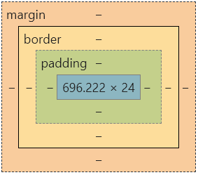

## 請找出三個課程裡面沒提到的 HTML 標籤並一一說明作用。
1. &lt;aside&gt;：主要是要用來呈現網頁的附加內容，通常與主內容 section 做區隔，會放在左右側邊。可搭配 css 屬性 `float: left (right)` 使用。
2. &lt;figure&gt; : 用來呈現圖片以及其說明，便於將圖及說明連結在一起，內層說明可用 &lt;figcaption&gt; 包住，和 &lt;aside&gt; 的蠻類似，但 &lt;figure&gt; 中的內容和主容間有直接關係，而 &lt;aside&gt; 是有點關係而已。

3. &lt;mark&gt;: 讓文字有螢光筆的效果，為了突顯內容

## 請問什麼是盒模型（box modal）

所有的 html 元素都可以看做一個盒子，盒子由外而內包含 margin、border、padding、content，是一個用於網頁設計和布局的一個輔助工具（如下圖），開啟 Chrome 的 DevTools 就有 box modal 可以觀察網頁的結構，也可藉由此視覺化的工具來調整 html 標籤、 css selector 和參數。

1. **margin 外邊距**：擴增邊框外的區域，是透明的
2. **border 邊框**：圍繞內邊距和內容的邊框
3. **padding 內邊距**：為清除內容周圍的區域，是透明的
4. **content 內容**：用於顯示文本和圖像

## 請問 display: inline, block 跟 inline-block 的差別是什麼？
- **inline**：對於 a、 span 做調整，可併排一列，但調整寬高、上下邊距沒用，可加些背景顏色或寬距。
- **block**：對於 div、h1、p… 做調整，自己站滿一列，可設定大小間距等等。
- **inline-block**： 結合 block 和 inline 的優點（可併排），對外像 inline 可併排，對內向 block 可調各種屬性，在 CSS 加上 display: inline-block。

## 請問 position: static, relative, absolute 跟 fixed 的差別是什麼？

|    項目     | static | relative | fixed | absolute |  
| :------: | :----: | :------: | :---: | :------: |
| 排版流 | 遵循排版流 | 遵循排版流 | 跳脫排版流 | 跳脫排版流 |
| 定位基準點 | 瀏覽器 | 元素原本的位置 | 瀏覽器 viewport  | 往上找第一個非 static 的元素 |
| 其它 | 網頁預設的定位方法 | 不會影響其他元素的位置 | 不論網頁如何捲動，都不會改變位置 | 下個元素會照原本的排版方式補位 |